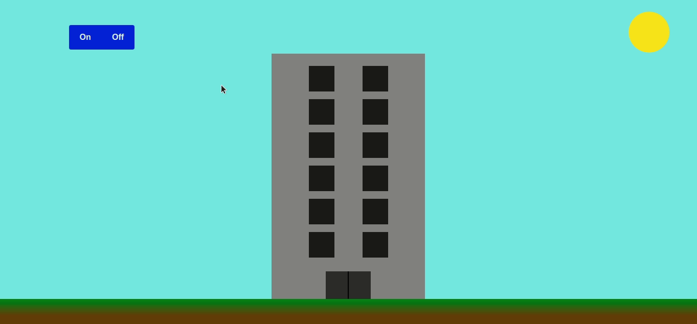

<h1 align="center">
  Desafio after.sale React
</h1>

<p align="center">
  <a href="#-tecnologias">Tecnologias</a>&nbsp;&nbsp;&nbsp;|&nbsp;&nbsp;&nbsp;
  <a href="#-projeto">Projeto</a>
</p>


<br>

<p align="center">
  
</p>


## 🚀 Tecnologias

Tecnologias utilizadas:

- ReactJS
- CSS modules

## 💻 Projeto

Nesse projeto refiz um desafio que fiz anteriormente para uma vaga de emprego, mas agora utilizando ReactJS. A aplicação consiste em um prédio com janelas que reagem ao clique acendendo ou apagando sua luz e um botão global que afeta todas as janelas, além disso, o cenário e o prédio tẽm seu estado atualizado conforme os horários de nascer e põr do sol que são disponibilizados pela Sunset Sunrise API.
---

#### 🛠️ Instale o projeto na sua máquina:

```bash

    # Clonar o repositório
    $ git clone https://github.com/marcoskloss/teste-aftersale-react.git

    # Entrar no diretório
    $ cd teste-aftersale-react

    # Instalando as dependencias com Yarn
    $ yarn install
    # Executando a aplicação
    $ yarn start
    
    # Instalando as dependencias com NPM
    $ npm install
    # Executando a aplicação
    $ npm run start
```

---

<h3 align="center" >Conecte-se comigo! 😉</h3>
<p align="center">
  <a href="https://www.linkedin.com/in/marcos-kloss/">
    
  </a>&ensp;
</p>
